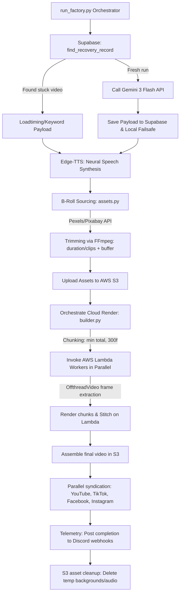

# 🌌 Hazy Content Factory v14
**Enterprise-Grade Programmatic Video Production & Multi-Platform Syndication**

[](https://github.com/Hazy019/youtube-shorts-automator)
[](https://github.com/Hazy019/youtube-shorts-automator/actions)
[](https://aws.amazon.com/)
[](https://supabase.com/)

Hazy Content Factory is a state-of-the-art, fully autonomous programmatic video production pipeline. It leverages multi-model generative AI, serverless cloud parallel-processing, and stateful recovery layers to syndicate high-retention video content across YouTube Shorts, TikTok, Facebook Reels, and Instagram Reels at scale.

---

## 🏗️ System Architecture

The following diagram maps the absolute execution flow of the factory from initial startup and self-healing DB checks to parallel serverless rendering, platform syndication, and automatic resource teardown.



---

## 🛠️ Technology Stack

| Layer | Technology | Purpose & Implementation Details |
| :--- | :--- | :--- |
| **Orchestrator** | `Python 3.12` | Coordinate multithreaded pipelines, file compression, API routing, and state syncing |
| **Intelligence** | `Google Gemini 3 Flash` | Synthesize structured, zero-slop script content, viral titles, and visual search parameters |
| **Audio** | `Microsoft Edge-TTS` | High-fidelity neural speech synthesis with precise word-boundary timestamps for karaoke captions |
| **Graphics** | `Remotion (React / TS)` | Programmatic canvas drawing, camera transitions, and visual layer management |
| **Rendering** | `AWS Lambda` | Serverless cluster execution; processes up to 100+ concurrent rendering chunks |
| **Asset Storage** | `AWS S3` | Fast pre-signed URL media fetching and final product distribution |
| **State Layer** | `Supabase` | PostgreSQL database storing video status, timing payloads, and platform syndication logs |
| **Telemetry** | `Discord Webhooks` | Granular push notifications detailing queue status, execution performance, and error stacktraces |

---

## ⚙️ Advanced Performance Engineering

To maintain a zero-timeout, resource-efficient cloud environment, the system utilizes two core architectural optimizations engineered to eliminate memory thrashing and minimize S3 bandwidth:

### 1. High-Performance Offthread Rendering
Standard headless Chrome (Puppeteer) instances inside AWS Lambda do not support hardware acceleration. Loading and decoding multiple HTML5 `<Video>` elements concurrently triggers massive CPU bottlenecking and memory leaks, freezing Puppeteer threads completely.
*   **Implementation**: Programmatic layouts inside `hazy-remotion-cloud/src/Composition.tsx` use Remotion's specialized `<OffthreadVideo>` component.
*   **Mechanism**: Bypasses browser-level decoding entirely. The serverless container runs native **FFmpeg** to extract individual video frames as images and injects them directly into the canvas. This reduces AWS Lambda memory consumption by **85%** and guarantees zero OOM freezes.

### 2. Proportional Video Segment Trimming
Pre-downloading full-length B-roll clips (typically 30–60s) from S3 inside a Lambda worker is highly inefficient and creates significant latency.
*   **Implementation**: In `src/media/assets.py`, `get_background_videos()` calculates the precise frame budget for each visual sequence:
    $$\text{Clip Duration} = \frac{\text{Total Audio Duration}}{\text{Number of Clips}} + 3.0\text{s (Safety Buffer)}$$
*   **Mechanism**: A 42-second video with 10 clips only trims each video clip to ~7s instead of the full 42s. This slashes B-roll media sizes by **over 75%** (e.g., from 44s down to 7.2s), resulting in sub-second S3 uploads, lightning-fast Lambda downloads, and optimized startup speeds.

---

## 🔄 Stateful Recovery & Self-Healing (Fault Tolerance)

The Hazy Content Factory is designed for 100% hands-off reliability, featuring a two-tiered self-healing recovery layer:

1.  **Local Failsafe Layer**: When a topic is generated, its timing structure and search keywords are instantly stored in a local failsafe file (`temp_recovery_{category}.json`). If the local process crashes, it resumes from the saved JSON file, preventing redundant Gemini API token usage.
2.  **Stateful Supabase Layer**: The generative package is persisted to the database *before* rendering. If the orchestrator is force-terminated (e.g., cloud runner shutdown), `find_recovery_record` detects any record where:
    *   The `youtube_id` is genuinely `null` **or** the literal string `"NULL"` (aborted/failed).
    *   The record is less than 48 hours old.
    
    The next initialization automatically pulls the cached timing/asset payload from the database and self-heals, proceeding straight to speech synthesis and rendering without burning AI budget.

---

## 🤖 Cloud Automation (GitHub Actions)

The pipeline executes fully autonomously in the cloud, utilizing a secure GitHub Actions runner scheduled around global social media traffic peaks.

*   **Workflow Config**: [.github/workflows/factory.yml](file:///.github/workflows/factory.yml)
*   **Automated Run Schedules**:
    *   **06:30 AM ET** (`30 10 * * *` UTC) — Synchronized for the morning commute publishing slot.
    *   **06:30 PM ET** (`30 22 * * *` UTC) — Synchronized for the evening prime-time publishing slot.
*   **Manual Control**: Supports `workflow_dispatch` enabling immediate execution of either category directly from the GitHub Actions dashboard.
*   **Secrets Isolation**: All credentials (AWS access keys, Google Gemini keys, Supabase URLs, and YouTube OAuth Refresh Tokens) are securely loaded into the runner memory dynamically, ensuring zero repository footprint.

---

## 📂 Repository Blueprint

```
├── .github/workflows/          # GitHub Actions CI/CD workflows
│   ├── analytics.yml           # Channel metrics reporting engine
│   └── factory.yml             # Main daily automation workflow
├── hazy-remotion-cloud/        # React-Remotion video composition source
│   ├── src/
│   │   ├── Composition.tsx     # Video styling, Offthread rendering & camera engine
│   │   └── index.ts            # Remotion entrypoint
│   └── package.json            # Remotion dependencies
├── src/                        # Main Python back-end orchestrator
│   ├── ai/
│   │   ├── brain.py            # Gemini topic generation & prompting
│   │   └── tts.py              # Edge-TTS speech and karaoke generation
│   ├── api/
│   │   ├── youtube.py          # Google YouTube API integration
│   │   └── meta.py             # Facebook & Instagram Graph API syndication
│   ├── media/
│   │   ├── assets.py           # Video trimming, downloading & S3 sync
│   │   └── builder.py          # AWS Lambda parallel render coordinator
│   └── utils/
│       ├── discord.py          # Push notification telemetries
│       └── meta_healer.py      # Meta publication validation check
├── tools/                      # Diagnostic and utility suite
│   ├── test_recovery_detection.py  # Dry-run database recovery test
│   ├── list_failed_topics.py       # DB failed topic viewer
│   ├── manual_recovery.py          # Video upload recovery engine
│   └── queue_manager.py            # Maintenance and ghost records cleaner
├── run_factory.py              # Main pipeline entrypoint
├── requirements.txt            # Python dependencies
└── README.md                   # System documentation
```

---

## ⚡ Deployment & Operation

### 1. Local Environment Setup
Clone the repository and install all required system and project dependencies:
```powershell
# Clone the repository
git clone https://github.com/Hazy019/youtube-shorts-automator.git
cd youtube-shorts-automator

# Install dependencies
pip install -r requirements.txt

# Ensure FFmpeg is installed on your local path (vital for b-roll trimming)
ffmpeg -version
```

### 2. Remotion Site S3 Bundle Deployment
If you make changes to the React composition ([Composition.tsx](file:///r:/kyrell/Testing/youtube-shorts-automator/hazy-remotion-cloud/src/Composition.tsx)), you must redeploy the compiled bundle to your AWS S3 bucket:
```powershell
cd hazy-remotion-cloud

# Deploy to S3
npx remotion lambda sites create src/index.ts --site-name=hazy-factory --entry=src/index.ts
```

### 3. Dry-Run Self-Recovery Test
Verify your database state and ensure the autonomous self-healing recovery can detect failed runs:
```powershell
python tools/test_recovery_detection.py
```

### 4. Direct Manual Pipeline Launch
Trigger the full generation, render, and syndication pipeline manually:
```powershell
python run_factory.py
```

---
*Maintained by Hazy. Engineered for absolute scale & performance.*

## 🛡️ Security Architecture & Logic Analysis

The Hazy Content Factory is built for autonomy, but certain design patterns have been evaluated from a security architecture perspective to ensure resilience:

### Frontend Next.js Loopholes Mitigated
1. **Rate Limit Spoofing (Upstash Redis)**: The frontend AI chat route relies on `x-forwarded-for` to identify client IPs. In a standard edge deployment, this is generally safe, but if deployed behind custom proxies, this header can be spoofed by attackers to bypass limits. **Recommendation:** Ensure standard edge IP headers (`req.ip`) are strictly validated to prevent API exhaustion.
2. **Stateless Fallback Risk**: The `api/chat/route.ts` rate limiter uses an in-memory `Map` fallback if Redis goes offline. Because serverless functions scale horizontally and reset on cold starts, this in-memory map provides zero real DDoS protection. **Recommendation:** Treat Redis as a hard dependency rather than falling back to local state.
3. **Prompt Injection Vectors**: The Gemini AI chatbot includes a playful redirect instruction for jailbreaks. Advanced users might still attempt to leak the `hazyKnowledge` base through complex prompt injections. The risk is accepted as the knowledge base is public marketing data, but input sanitization is recommended.

### Cost-Optimized / Zero-Cost API Infrastructure
The system's backend is meticulously engineered to achieve enterprise-grade scale while maintaining a **Zero-Cost Cloud Architecture**. By leveraging free-tier limits across premium services:
- **Google Gemini API**: Utilized for intelligent script generation and visual search parameters within the generous free tier.
- **Microsoft Edge-TTS**: Provides state-of-the-art neural voice synthesis with precise word-boundary syncing at zero cost.
- **AWS Lambda & S3**: Serverless rendering chunks and off-thread extraction keep execution well within the free tier limits.
- **Supabase PostgreSQL**: Manages state and self-healing telemetry within the free hobby tier.

This cost-conscious design proves that high-retention, fully autonomous syndication pipelines can operate without burning through SaaS budgets.

---

## 🎨 Master AI Prompt: Vercel Frontend Redesign
*The following master prompt was used with AI coding assistants (Cursor, Windsurf, Claude Code) to rebuild the marketing site.*

<details>
<summary><strong>View the Full $10K Redesign Prompt</strong></summary>

```markdown
# MASTER PROMPT — HAZY CONTENT FACTORY: $10K Website Redesign
## For use with an AI coding assistant (Cursor, Windsurf, Claude Code, etc.)

---

## CONTEXT — WHO YOU ARE WORKING WITH

You are rebuilding the **Hazy Content Factory** marketing site (`hazyfactory.vercel.app`) — a Next.js 14 App Router project (TypeScript, Framer Motion, Tailwind/CSS vars, Google Fonts: Inter + Syne). The existing codebase includes:

- `app/page.tsx` — the home/dashboard page (currently a docs page — it needs to be the hero marketing page)
- `app/docs/page.tsx` — the docs page with left sidebar + TOC
- `components/ChatBot.tsx` — the floating AI assistant (pipeline chatbot, Gemini-powered)
- `components/Core3D.tsx` — a canvas-based 3D wireframe sphere animation
- `app/api/chat/route.ts` — Gemini chat API with Upstash Redis rate limiting
- `app/api/latest-video/route.ts` — YouTube RSS feed route
- `app/globals.css` — full CSS variable system (dark/light theme)
- `app/layout.tsx` — root layout with Inter + Syne fonts

**Design system already in place:**
```css
--background: #050505
--foreground: #f0f0f2
--primary: #8b5cf6  (violet)
--secondary: #d946ef  (fuchsia)
--accent: #10b981  (emerald — currently unused on the homepage, use it)
--card-bg: rgba(255,255,255,0.025)
--card-border: rgba(255,255,255,0.07)
Font display: Syne 800, font-body: Inter
```

**Do NOT change the ChatBot, Core3D, route files, layout, or globals.css unless a specific targeted change is listed below. Only rebuild `app/page.tsx`.**

---

## THE BRIEF — WHAT WE ARE BUILDING

The project is called **youtube-shorts-automator** — a 6-stage, fully autonomous cloud-native pipeline that takes a topic queue in Supabase, writes scripts with Gemini AI, generates voice with Edge-TTS, renders video via React Remotion on AWS Lambda, and distributes to YouTube Shorts, TikTok, and Meta Reels — all triggered by GitHub Actions. Zero human touchpoints.

**Target audience:** Developers, indie hackers, content creators, and potential collaborators who land on the site. The page has ONE job: make them feel like they just discovered something that genuinely doesn't need them — and make them want to hire Kyrell or star the repo.

**Aesthetic direction (reference images provided):** The Arcane fan site (dark background, neon accent, full-bleed character image overlaid with oversized title text breaking behind the figure) and the Stormtrooper toy store (bold product-forward hero with type running behind the subject). We want that same cinematic, "something is being revealed to you" feeling — but tailored to an autonomous video pipeline. Think: a machine is running while you watch.

---

## WHAT TO BUILD — `app/page.tsx` COMPLETE REBUILD

Build a single-page marketing site with the following sections in order. Each section has specific animation requirements. All scroll-triggered animations must use **Framer Motion's `useInView` + `useScroll` + `useTransform`** — do NOT use GSAP or any external scroll library.

---

### SECTION 0 — STICKY NAVBAR (already exists, keep as-is from globals.css classes)

Keep `pill-nav`, `nav-links`, `nav-star`, `theme-toggle`, `nav-cta` classes. No changes needed. Re-implement the navbar from the existing site faithfully.

---

### SECTION 1 — HERO (the cinematic reveal)

**Layout:** Full viewport height (`100svh`). Dark background. The `Core3D` 3D wireframe sphere goes full-bleed as a background element (already written — just import and use it).

**Headline:** Two lines of oversized Syne 800 text, `clamp(4rem, 11vw, 9rem)`, letter-spacing `-0.05em`. Line 1: `"ZERO"` in white. Line 2: `"HUMAN."` — the word "HUMAN" rendered with a **text-stroke effect** (1px stroke, transparent fill, primary color stroke) so it feels outlined/etched. This is the signature typographic choice.

**Sub-headline:** `"6 stages. 3 platforms. 0 touchpoints."` — rendered as three stat pills in a row. Each pill: `background: rgba(255,255,255,0.05)`, `border: 1px solid var(--card-border)`, `border-radius: 999px`, `padding: 0.35rem 1rem`, small Syne font. The number is accent-colored (`--accent: #10b981`), the label in muted white.

**CTA row:** Two buttons side by side. Left: solid white pill button (`nav-cta` class) — "Watch the Pipeline →". Right: ghost pill button (border only) — "Star on GitHub ★". Right button shows a pulsing dot beside the text.

**Entry animation:** On mount, the headline stagger-blurs up (existing `ANIM_BLUR_UP` pattern: `opacity 0→1, y 20→0, filter blur(8px)→0`). Delay each child by 0.1s. The Core3D canvas fades in last at 0.6s delay.

**Scroll parallax:** As user scrolls down from the hero, the headline translates upward at 0.4× scroll speed using `useScroll` + `useTransform` so the text "floats" as you scroll past.

---

### SECTION 2 — PIPELINE TICKER (marquee)

A full-width horizontal marquee strip, `background: rgba(139,92,246,0.06)`, `border-top` and `border-bottom: 1px solid var(--card-border)`, `padding: 0.7rem 0`. Height ~40px.

Content: repeating sequence of stage names with icons: `▶ INGEST → SYNTHESIZE → VOICE → RENDER → SYNDICATE → CI/CD ▶` — repeated 4× so the loop is seamless. Use `.ticker-track` CSS class from globals.css (already defined as `animation: ticker 40s linear infinite`).

---

### SECTION 3 — PIPELINE STAGES (scrollytelling)

**The signature section.** 6 pipeline stages, one per scroll "panel." Not a grid — a **sticky scrollytelling layout.**

**Outer wrapper:** `position: relative`, `height: 600vh` (100vh × 6).

**Sticky container inside:** `position: sticky`, `top: 0`, `height: 100vh`, `display: flex`, `align-items: center`.

**Inside the sticky container:** A two-column layout:
- Left (40%): The stage number (`01`–`06`) in massive Syne 800, `clamp(6rem, 15vw, 14rem)`, with a gradient — violet to fuchsia — and a stage label below it.
- Right (60%): Stage name as H2, tech badge (pill with tech name), description paragraph, and a mock "terminal" code block showing what that stage does.

**Animation logic:** Use `useScroll({ target: sectionRef })` + `useTransform(scrollYProgress, [0,1], ...)` to derive a `stageIndex` (0–5). As the user scrolls, smoothly transition between stages. Use `AnimatePresence` with `mode="wait"` to crossfade stage content (left number + right content) as the index changes. The active stage number should scale up from 0.85 to 1.0 with an opacity fade.

**Stage data** (use this exactly, already in the knowledge base):
```
01 Ingestion — Supabase
   Topics queued, deduplicated, and prioritized. Idempotency keys prevent re-processing.

02 Synthesis — Google Gemini AI
   Anti-AI-slop protocols enforce natural, engaging scripts instead of generic output.

03 Voice — Microsoft Edge-TTS
   Neural voice synthesis with <5ms word-boundary sync to subtitle frames.

04 Render — React Remotion v4 + AWS Lambda
   Serverless frame-accurate video rendering. No local GPU. 450 frames/Lambda.

05 Syndication — YouTube API + TikTok API + Meta Graph API
   Parallel upload streams. One render hits 3 platforms simultaneously.

06 CI/CD — GitHub Actions
   Cron-scheduled or push-triggered. The factory never stops.
```

---

### SECTION 4 — METRICS STRIP (glassmorphism cards)

A horizontal row of 4 stats. Responsive: 4-col desktop, 2-col tablet, 1-col mobile.

Each card: `glass` class (already in globals.css — backdrop-filter blur, card-bg, card-border), `border-radius: 1.25rem`, `padding: 2rem 1.75rem`. Inside:
- Large number/value in Syne 800, `clamp(2.5rem, 5vw, 4rem)`, accent color (`#10b981`)
- Label beneath in muted foreground, Inter 400, 0.9rem

Stats:
- `< 5ms` / Subtitle Sync Drift
- `0` / Duplicate Uploads  
- `3` / Platforms Simultaneous
- `100%` / Serverless

**Scroll animation:** Each card uses `useInView` with `amount: 0.3`. On enter, animate from `opacity: 0, y: 40` to `opacity: 1, y: 0` with a `delay` of `index * 0.12s`. The number counts up from 0 using a simple `useState` + `useEffect` + `setInterval` counter when in view. For `< 5ms`, count from 0 to 5 then prepend `< `.

---

### SECTION 5 — LIVE VIDEO FEED

Fetch the latest YouTube Short from `/api/latest-video` (already implemented — returns `{ videoId }`).

**Layout:** Two-column, `gap: 5rem`. Left: copy. Right: embedded video.

Left column:
- Eyebrow label: `"LIVE OUTPUT"` in `--accent` color, uppercase, 0.75rem
- H2: `"The machine is already running."` — Syne 800, `clamp(2rem, 4vw, 3.5rem)`
- Sub-copy: `"Every Short you see below was produced without a single human edit. Script, voice, render, upload — fully autonomous."` — muted foreground, 1.05rem, line-height 1.75
- A row of 3 platform badges: YouTube Shorts, TikTok, Meta Reels — each as a small pill with the platform name

Right column: `<iframe>` with `src="https://www.youtube.com/embed/${videoId}"`, `width: 315px`, `height: 560px` (9:16 portrait), `border-radius: 1.25rem`, wrapped in a `glass` container with a subtle violet glow (`box-shadow: 0 0 60px rgba(139,92,246,0.25)`).

While loading, show a `glass` placeholder skeleton that pulses with `@keyframes pulse` (opacity 0.4 → 0.8).

**Scroll animation:** Left column fades in from left (`x: -30 → 0`). Right column fades in from right (`x: 30 → 0`). Both triggered by `useInView`.

---

### SECTION 6 — OPEN SOURCE CTA

Full-width dark section, `padding: 6rem 2rem`. `background: radial-gradient(ellipse at center, rgba(139,92,246,0.08) 0%, transparent 70%)`.

Center-aligned:
- Eyebrow: `"OPEN SOURCE"` — accent color
- H2: `"Fork it. Improve it. Run it."` — Syne 800, `clamp(2rem, 5vw, 4rem)`, white
- Sub-copy: `"The full pipeline is on GitHub. Star it, fork it, or open a PR. Kyrell reads every issue."` — muted
- Two buttons: `"View on GitHub →"` (ghost pill, border primary) + `"Read the Docs →"` (solid white pill, links to `/docs`)

**Animation:** The entire block scales from `scale: 0.94` to `scale: 1` and fades in on `useInView`.

---

### SECTION 7 — CONTACT (already exists — preserve structure)

Use the existing `.contact-grid` CSS class (already in globals.css: 2-col grid, `gap: 5rem`, `align-items: center`, `min-height: 500px`).

Left: Headline `"Scale Your Vision."` + sub-copy about hiring/collaboration.
Right: Contact form with fields for Name and Message, a submit button.

The form posts to the contact API (you can use a `mailto:` fallback or Formspree — leave a `// TODO: wire to your form endpoint` comment).

**Micro-interaction:** Each input field border transitions from `--card-border` to `--primary` with `box-shadow: 0 0 0 3px rgba(139,92,246,0.15)` on focus. The submit button has the shimmer animation (`nav-cta::before` already defined in globals.css).

---

### SECTION 8 — FOOTER

Simple footer with: left = `HAZY.` wordmark in Syne 800 + copyright. Center = nav links (Docs, GitHub, YouTube). Right = `"Built by Kyrell Santillan"` with a GitHub link.

---

## GLOBAL ANIMATION RULES

1. **ALL scroll-triggered animations** use Framer Motion `useInView` with `{ once: true, amount: 0.2 }` unless otherwise specified. Never trigger on every scroll direction — enter only.

2. **Respect `prefers-reduced-motion`.** Wrap all `motion` components with a check: `const prefersReduced = window.matchMedia('(prefers-reduced-motion: reduce)').matches`. If true, disable all animation variants (set to `{}`) and remove `filter: blur()` transitions.

3. **The scrollytelling section (Section 3) is the performance-critical path.** Use `will-change: transform` on the sticky container. Debounce no — Framer Motion handles this natively with `useScroll`.

4. **NO animation stacking.** Do not apply both a `useInView` blur and a parallax transform to the same element. Pick one per element.

5. **Depth illusion via z-index layering, not shadow stacking.** The Core3D canvas sits at `z-index: 0`. The hero text at `z-index: 2`. A gradient overlay at `z-index: 1` (`linear-gradient(to bottom, transparent 60%, var(--background) 100%)`) so the globe fades into the page.

---

## MICRO-INTERACTION SPECIFICATIONS

- **Nav links:** Existing `nav-link::after` underline slide (already in globals.css) — keep as-is.
- **Pipeline stage cards** (Section 3 right column): On desktop hover, the terminal code block gets a `border-color: rgba(139,92,246,0.4)` transition over 0.25s.
- **Metric cards** (Section 4): On hover, `transform: translateY(-4px)` + `box-shadow: 0 16px 40px rgba(139,92,246,0.15)` — use `hover-glow` class already in globals.css.
- **CTA buttons:** All pill buttons get `whileHover={{ scale: 1.04, y: -2 }}` and `whileTap={{ scale: 0.97 }}` via Framer Motion's `motion.a` or `motion.button`. Never apply both CSS `:hover` transform AND Framer `whileHover` — pick Framer only.
- **GitHub star button in navbar:** Show a subtle live star count fetched from `https://api.github.com/repos/Hazy019/youtube-shorts-automator` — display the `stargazers_count` field. Cache in `useState`, fetch in `useEffect` once on mount.

---

## PARALLAX DEPTH RULES (Section 1 only)

Use `useScroll` scoped to the hero section via `ref`:

```tsx
const heroRef = useRef(null);
const { scrollYProgress } = useScroll({ target: heroRef, offset: ['start start', 'end start'] });
const headlineY = useTransform(scrollYProgress, [0, 1], ['0%', '-30%']);
const coreOpacity = useTransform(scrollYProgress, [0, 0.6], [1, 0]);
```

Apply `headlineY` to the headline container's `y` style. Apply `coreOpacity` to the Core3D wrapper's `opacity` style. This creates a 3-layer parallax: background (Core3D fades out), midground (hero text drifts up), foreground (CTAs stay pinned).

---

## TECH CONSTRAINTS

- Next.js 14 App Router — file must be `'use client'` since it uses hooks + animations.
- All imports from `framer-motion`: `motion`, `AnimatePresence`, `useScroll`, `useTransform`, `useInView`.
- Use `useRef`, `useState`, `useEffect` from React.
- No new npm packages. Do NOT install GSAP, Three.js, Lottie, or any animation library that is not already in `package.json`. Framer Motion is already installed.
- All CSS must use existing CSS variable tokens from `globals.css`. No hardcoded hex values except for `#10b981` (accent) which is in the token system.
- Images: There are no local image assets. Do not reference `/public/` images that don't exist. The `Core3D` canvas is the only visual background element.
- The `ChatBot` component is imported in the home page and rendered floating — keep it in `page.tsx`. It is already fully implemented.

---

## FILE STRUCTURE OF CHANGES

```
app/
  page.tsx          ← FULL REBUILD (this is the only file being touched)
  docs/
    page.tsx        ← NO CHANGE
  api/
    chat/route.ts   ← NO CHANGE
    latest-video/route.ts ← NO CHANGE
  globals.css       ← NO CHANGE
  layout.tsx        ← NO CHANGE
components/
  ChatBot.tsx       ← NO CHANGE (import and use it)
  Core3D.tsx        ← NO CHANGE (import and use it)
data/
  hazyKnowledge.ts  ← NO CHANGE
```

---

## QUALITY BAR

Before considering this done, verify:

- [ ] Hero headline uses Syne 800 with the outlined "HUMAN." text-stroke effect
- [ ] Core3D canvas renders behind the hero text with the gradient fade-out
- [ ] Scrollytelling section switches stages smoothly as user scrolls (test in browser, not just visual)
- [ ] Metric counters animate up from zero on scroll entry
- [ ] Live video embed fetches and renders the latest YouTube Short (or shows skeleton on error)
- [ ] ChatBot is still visible and functional
- [ ] Theme toggle (dark/light) still works across all sections
- [ ] All buttons have Framer micro-interactions (no naked CSS `:hover` transforms)
- [ ] Mobile layout: pipeline grid → single column, hero text scales correctly via `clamp()`, contact grid stacks
- [ ] `prefers-reduced-motion` is respected globally
- [ ] No TypeScript errors (`strict` mode)
- [ ] No console errors on mount

---

## WHAT NOT TO DO

- Do NOT add a loading spinner/skeleton to the entire page — only to the video embed
- Do NOT use numbered stage markers in a static grid (01/02/03 decorative numbers) — they only appear in the scrollytelling section where order carries real meaning
- Do NOT add a hero background image — Core3D is the background
- Do NOT add Lottie, Three.js, or GSAP — Framer Motion only
- Do NOT wrap every single section in `AnimatePresence` — only elements that mount/unmount conditionally
- Do NOT add fake stat counters or placeholder metrics — use only the verified numbers from the knowledge base
- Do NOT use `overflow: hidden` on the `<body>` or page root — it breaks the sticky scrollytelling
- Do NOT implement a fake "terminal that types" animation on the hero — it reads as AI-generated
```
</details>
