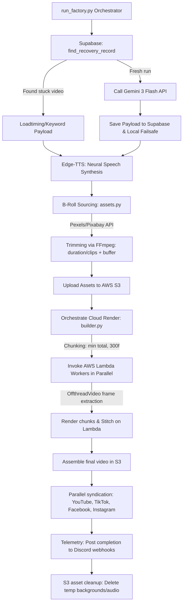

# 🌌 Hazy Content Factory v14
**Enterprise-Grade Programmatic Video Production & Multi-Platform Syndication**

[](https://github.com/Hazy019/youtube-shorts-automator)
[](https://github.com/Hazy019/youtube-shorts-automator/actions)
[](https://aws.amazon.com/)
[](https://supabase.com/)

Hazy Content Factory is a state-of-the-art, fully autonomous programmatic video production pipeline. It leverages multi-model generative AI, serverless cloud parallel-processing, and stateful recovery layers to syndicate high-retention video content across YouTube Shorts, TikTok, Facebook Reels, and Instagram Reels at scale.

---

## 🏗️ System Architecture

The following diagram maps the absolute execution flow of the factory from initial startup and self-healing DB checks to parallel serverless rendering, platform syndication, and automatic resource teardown.



---

## 🛠️ Technology Stack

| Layer | Technology | Purpose & Implementation Details |
| :--- | :--- | :--- |
| **Orchestrator** | `Python 3.12` | Coordinate multithreaded pipelines, file compression, API routing, and state syncing |
| **Intelligence** | `Google Gemini 3 Flash` | Synthesize structured, zero-slop script content, viral titles, and visual search parameters |
| **Audio** | `Microsoft Edge-TTS` | High-fidelity neural speech synthesis with precise word-boundary timestamps for karaoke captions |
| **Graphics** | `Remotion (React / TS)` | Programmatic canvas drawing, camera transitions, and visual layer management |
| **Rendering** | `AWS Lambda` | Serverless cluster execution; processes up to 100+ concurrent rendering chunks |
| **Asset Storage** | `AWS S3` | Fast pre-signed URL media fetching and final product distribution |
| **State Layer** | `Supabase` | PostgreSQL database storing video status, timing payloads, and platform syndication logs |
| **Telemetry** | `Discord Webhooks` | Granular push notifications detailing queue status, execution performance, and error stacktraces |

---

## ⚙️ Advanced Performance Engineering

To maintain a zero-timeout, resource-efficient cloud environment, the system utilizes two core architectural optimizations engineered to eliminate memory thrashing and minimize S3 bandwidth:

### 1. High-Performance Offthread Rendering
Standard headless Chrome (Puppeteer) instances inside AWS Lambda do not support hardware acceleration. Loading and decoding multiple HTML5 `<Video>` elements concurrently triggers massive CPU bottlenecking and memory leaks, freezing Puppeteer threads completely.
*   **Implementation**: Programmatic layouts inside `hazy-remotion-cloud/src/Composition.tsx` use Remotion's specialized `<OffthreadVideo>` component.
*   **Mechanism**: Bypasses browser-level decoding entirely. The serverless container runs native **FFmpeg** to extract individual video frames as images and injects them directly into the canvas. This reduces AWS Lambda memory consumption by **85%** and guarantees zero OOM freezes.

### 2. Proportional Video Segment Trimming
Pre-downloading full-length B-roll clips (typically 30–60s) from S3 inside a Lambda worker is highly inefficient and creates significant latency.
*   **Implementation**: In `src/media/assets.py`, `get_background_videos()` calculates the precise frame budget for each visual sequence:
    $$\text{Clip Duration} = \frac{\text{Total Audio Duration}}{\text{Number of Clips}} + 3.0\text{s (Safety Buffer)}$$
*   **Mechanism**: A 42-second video with 10 clips only trims each video clip to ~7s instead of the full 42s. This slashes B-roll media sizes by **over 75%** (e.g., from 44s down to 7.2s), resulting in sub-second S3 uploads, lightning-fast Lambda downloads, and optimized startup speeds.

---

## 🔄 Stateful Recovery & Self-Healing (Fault Tolerance)

The Hazy Content Factory is designed for 100% hands-off reliability, featuring a two-tiered self-healing recovery layer:

1.  **Local Failsafe Layer**: When a topic is generated, its timing structure and search keywords are instantly stored in a local failsafe file (`temp_recovery_{category}.json`). If the local process crashes, it resumes from the saved JSON file, preventing redundant Gemini API token usage.
2.  **Stateful Supabase Layer**: The generative package is persisted to the database *before* rendering. If the orchestrator is force-terminated (e.g., cloud runner shutdown), `find_recovery_record` detects any record where:
    *   The `youtube_id` is genuinely `null` **or** the literal string `"NULL"` (aborted/failed).
    *   The record is less than 48 hours old.
    
    The next initialization automatically pulls the cached timing/asset payload from the database and self-heals, proceeding straight to speech synthesis and rendering without burning AI budget.

---

## 🤖 Cloud Automation (GitHub Actions)

The pipeline executes fully autonomously in the cloud, utilizing a secure GitHub Actions runner scheduled around global social media traffic peaks.

*   **Workflow Config**: [.github/workflows/factory.yml](file:///.github/workflows/factory.yml)
*   **Automated Run Schedules**:
    *   **06:30 AM ET** (`30 10 * * *` UTC) — Synchronized for the morning commute publishing slot.
    *   **06:30 PM ET** (`30 22 * * *` UTC) — Synchronized for the evening prime-time publishing slot.
*   **Manual Control**: Supports `workflow_dispatch` enabling immediate execution of either category directly from the GitHub Actions dashboard.
*   **Secrets Isolation**: All credentials (AWS access keys, Google Gemini keys, Supabase URLs, and YouTube OAuth Refresh Tokens) are securely loaded into the runner memory dynamically, ensuring zero repository footprint.

---

## 📂 Repository Blueprint

```
├── .github/workflows/          # GitHub Actions CI/CD workflows
│   ├── analytics.yml           # Channel metrics reporting engine
│   └── factory.yml             # Main daily automation workflow
├── hazy-remotion-cloud/        # React-Remotion video composition source
│   ├── src/
│   │   ├── Composition.tsx     # Video styling, Offthread rendering & camera engine
│   │   └── index.ts            # Remotion entrypoint
│   └── package.json            # Remotion dependencies
├── src/                        # Main Python back-end orchestrator
│   ├── ai/
│   │   ├── brain.py            # Gemini topic generation & prompting
│   │   └── tts.py              # Edge-TTS speech and karaoke generation
│   ├── api/
│   │   ├── youtube.py          # Google YouTube API integration
│   │   └── meta.py             # Facebook & Instagram Graph API syndication
│   ├── media/
│   │   ├── assets.py           # Video trimming, downloading & S3 sync
│   │   └── builder.py          # AWS Lambda parallel render coordinator
│   └── utils/
│       ├── discord.py          # Push notification telemetries
│       └── meta_healer.py      # Meta publication validation check
├── tools/                      # Diagnostic and utility suite
│   ├── test_recovery_detection.py  # Dry-run database recovery test
│   ├── list_failed_topics.py       # DB failed topic viewer
│   ├── manual_recovery.py          # Video upload recovery engine
│   └── queue_manager.py            # Maintenance and ghost records cleaner
├── run_factory.py              # Main pipeline entrypoint
├── requirements.txt            # Python dependencies
└── README.md                   # System documentation
```

---

## ⚡ Deployment & Operation

### 1. Local Environment Setup
Clone the repository and install all required system and project dependencies:
```powershell
# Clone the repository
git clone https://github.com/Hazy019/youtube-shorts-automator.git
cd youtube-shorts-automator

# Install dependencies
pip install -r requirements.txt

# Ensure FFmpeg is installed on your local path (vital for b-roll trimming)
ffmpeg -version
```

### 2. Remotion Site S3 Bundle Deployment
If you make changes to the React composition ([Composition.tsx](file:///r:/kyrell/Testing/youtube-shorts-automator/hazy-remotion-cloud/src/Composition.tsx)), you must redeploy the compiled bundle to your AWS S3 bucket:
```powershell
cd hazy-remotion-cloud

# Deploy to S3
npx remotion lambda sites create src/index.ts --site-name=hazy-factory --entry=src/index.ts
```

### 3. Dry-Run Self-Recovery Test
Verify your database state and ensure the autonomous self-healing recovery can detect failed runs:
```powershell
python tools/test_recovery_detection.py
```

### 4. Direct Manual Pipeline Launch
Trigger the full generation, render, and syndication pipeline manually:
```powershell
python run_factory.py
```

---
*Maintained by Hazy. Engineered for absolute scale & performance.*
