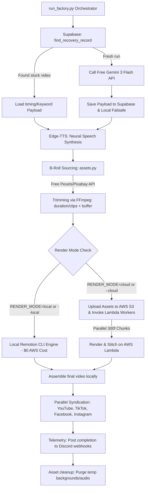

# 🌌 YouTube Shorts Automation

**Enterprise-Grade Programmatic Video Production & Multi-Platform Syndication**

[](https://github.com/Hazy019/youtube-shorts-automation)
[](https://github.com/Hazy019/youtube-shorts-automation/actions)
[-00C49F.svg?style=for-the-badge)](https://www.remotion.dev/)
[](https://aws.amazon.com/)
[](https://supabase.com/)

YouTube Shorts Automation is a state-of-the-art, fully autonomous programmatic video production pipeline. It leverages multi-model generative AI, serverless cloud parallel-processing, and stateful recovery layers to syndicate high-retention video content across YouTube Shorts, TikTok, Facebook Reels, and Instagram Reels at scale. 

**Cost-Effective by Design:** This system is engineered with a **Hybrid Compute Engine** to minimize operational costs by integrating with free-tier APIs and offering a **$0/month Zero-Cost Cloud Mode** via GitHub Actions + Remotion CLI, while preserving full enterprise support for **AWS Lambda + S3 parallel cluster rendering**.

---

## 🏗️ System Architecture & How It Works

The following diagram maps the absolute execution flow of the system across its **Hybrid Compute Engine**, allowing seamless switching between zero-cost local rendering and serverless cloud parallel processing.


```mermaid
graph TD
    A[run_factory.py Orchestrator] --> B[Supabase: find_recovery_record]
    B -->|Found stuck video| C[Load timing/Keyword Payload]
    B -->|Fresh run| D[Call Free Gemini 3 Flash API]
    D --> E[Save Payload to Supabase & Local Failsafe]
    C --> F[Edge-TTS: Neural Speech Synthesis]
    E --> F
    F --> G[B-Roll Sourcing: assets.py]
    G -->|Free Pexels/Pixabay API| H[Trimming via FFmpeg: duration/clips + buffer]
    H --> I{Render Mode Check}
    I -->|RENDER_MODE=local or --local| J1[Local Remotion CLI Engine - $0 AWS Cost]
    I -->|RENDER_MODE=cloud or --cloud| J2[Upload Assets to AWS S3 & Invoke Lambda Workers]
    J1 --> M[Assemble final video locally]
    J2 -->|Parallel 300f Chunks| L[Render & Stitch on AWS Lambda]
    L --> M
    M --> N[Parallel Syndication: YouTube, TikTok, Facebook, Instagram]
    N --> O[Telemetry: Post completion to Discord webhooks]
    O --> P[Asset cleanup: Purge temp backgrounds/audio]
```

### The 13 System Architecture Pillars

The platform is designed around 13 core enterprise architecture pillars ensuring high performance, zero downtime, and complete cost containment:

1. **Orchestration / Control Plane**: `run_factory.py` coordinates multi-stage pipelines, retries, and API routing.
2. **State Management & Persistence**: Supabase PostgreSQL tracks video status (`pending` → `script_ready` → `audio_ready` → `video_ready` → `SUCCESS`).
3. **Idempotency & Deduplication**: Hash checks & unique video IDs prevent duplicate processing across multi-platform feeds.
4. **Stateful Self-Healing Recovery**: Dual-layered local failsafe JSON and database record recovery resume interrupted tasks without wasting AI tokens.
5. **Decoupled Asset Sourcing**: Automatic asset fetching via Pexels/Pixabay with precise FFmpeg budget trimming.
6. **Distributed Serverless Compute**: Remotion on AWS Lambda for massive parallel chunk rendering.
7. **Asset Storage Hygiene**: AWS S3 pre-signed URL fetching and automatic post-upload object purging.
8. **Multi-Platform Syndication Engine**: Native platform API callers for YouTube, TikTok, Facebook Reels, and Instagram Reels.
9. **Telemetry & Real-Time Alerting**: Discord multi-webhook alerting feeds for logs, errors, posts, insights, and queue metrics.
10. **Automated CI/CD Scheduler**: GitHub Actions (`factory.yml`, `analytics.yml`, `meta_recovery.yml`) execute pipelines on traffic-peaked cron schedules.
11. **Secrets Isolation & Security**: Environment variables (`.env`) and encrypted GitHub secrets isolate all API credentials.
12. **Anti-Slop AI Prompting Engine**: Gemini 3 Flash system prompts with Edge-TTS karaoke word alignment for maximum retention.
13. **Cost-Containment & Hybrid Compute Engine**: Toggle between Zero-Cost Local GPU Rendering (`python run_factory.py --local`) and AWS Lambda Cloud Rendering (`python run_factory.py --cloud`).

---

## 🛠️ Technology Stack

| Layer | Technology | Purpose & Implementation Details |
| :--- | :--- | :--- |
| **Orchestrator** | `Python 3.12` | Coordinate multithreaded pipelines, file compression, API routing, and state syncing |
| **Frontend UI** | `Next.js 14 / TypeScript / Framer Motion` | A high-end visual dashboard displaying pipeline stats, interactive chatbots, and execution stages |
| **Intelligence** | `Google Gemini 3 Flash` | Synthesize structured scripts, viral titles, and visual search parameters (Free API) |
| **Audio** | `Microsoft Edge-TTS` | High-fidelity neural speech synthesis with precise word-boundary timestamps for karaoke captions |
| **Graphics** | `Remotion (React / TS)` | Programmatic canvas drawing, camera transitions, and visual layer management |
| **Hybrid Rendering** | `Remotion CLI (Local) / AWS Lambda (Cloud)` | Zero-cost local GPU execution or serverless parallel cluster execution |
| **Asset Storage** | `AWS S3` | Fast pre-signed URL media fetching and final product distribution |
| **State Layer** | `Supabase` | PostgreSQL database storing video status, timing payloads, and platform syndication logs |
| **Telemetry** | `Discord Webhooks` | Granular push notifications detailing queue status, execution performance, and error stacktraces |

---

## ⚙️ Advanced Performance Engineering

To maintain a zero-timeout, resource-efficient cloud environment, the system utilizes two core architectural optimizations engineered to eliminate memory thrashing and minimize S3 bandwidth:

### 1. High-Performance Offthread Rendering
Standard headless Chrome (Puppeteer) instances inside AWS Lambda do not support hardware acceleration. Loading and decoding multiple HTML5 `<Video>` elements concurrently triggers massive CPU bottlenecking and memory leaks, freezing Puppeteer threads completely.
*   **Implementation**: Programmatic layouts inside `hazy-remotion-cloud/src/Composition.tsx` use Remotion's specialized `<OffthreadVideo>` component.
*   **Mechanism**: Bypasses browser-level decoding entirely. The serverless container runs native **FFmpeg** to extract individual video frames as images and injects them directly into the canvas. This reduces AWS Lambda memory consumption by **85%** and guarantees zero OOM freezes.

### 2. Proportional Video Segment Trimming
Pre-downloading full-length B-roll clips (typically 30–60s) from S3 inside a Lambda worker is highly inefficient and creates significant latency.
*   **Implementation**: In `src/media/assets.py`, `get_background_videos()` calculates the precise frame budget for each visual sequence:
    $$\text{Clip Duration} = \frac{\text{Total Audio Duration}}{\text{Number of Clips}} + 3.0\text{s (Safety Buffer)}$$
*   **Mechanism**: A 42-second video with 10 clips only trims each video clip to ~7s instead of the full 42s. This slashes B-roll media sizes by **over 75%** (e.g., from 44s down to 7.2s), resulting in sub-second S3 uploads, lightning-fast Lambda downloads, and optimized startup speeds.

---

## 🔄 Stateful Recovery & Self-Healing (Fault Tolerance)

The system is designed for 100% hands-off reliability, featuring a two-tiered self-healing recovery layer:

1.  **Local Failsafe Layer**: When a topic is generated, its timing structure and search keywords are instantly stored in a local failsafe file (`temp_recovery_{category}.json`). If the local process crashes, it resumes from the saved JSON file, preventing redundant Gemini API token usage.
2.  **Stateful Supabase Layer**: The generative package is persisted to the database *before* rendering. If the orchestrator is force-terminated (e.g., cloud runner shutdown), `find_recovery_record` detects any record where:
    *   The `youtube_id` is genuinely `null` **or** the literal string `"NULL"` (aborted/failed).
    *   The record is less than 48 hours old.
    
    The next initialization automatically pulls the cached timing/asset payload from the database and self-heals, proceeding straight to speech synthesis and rendering without burning AI budget.

---

## 🤖 Cloud Automation (GitHub Actions)

The pipeline executes fully autonomously in the cloud, utilizing a secure GitHub Actions runner scheduled around global social media traffic peaks.

*   **Workflows**:
    *   **Main Factory Automation** ([factory.yml](.github/workflows/factory.yml)): Triggered at **04:30 AM EDT / 08:30 UTC** (`30 8 * * *`) and **04:30 PM EDT / 20:30 UTC** (`30 20 * * *`) to provide a 2.5-hour lead buffer before the 7:00 AM / 7:00 PM EDT peak traffic slots. Bypasses top-of-the-hour runner queue contention and executes the complete pipeline sequentially for channels. Supports manual override targeting through the `SHIFT_CHANNEL` environment variable.
    *   **Channel Metrics Reporting** ([analytics.yml](.github/workflows/analytics.yml)): Regularly executes telemetry reports, collecting analytics on published video performance and pushing insights to Discord channels.
    *   **Meta API Recovery** ([meta_recovery.yml](.github/workflows/meta_recovery.yml)): Runs automated validation to self-heal and retry failed Facebook Reels and Instagram Reels postings.
*   **Zero-Cost Cloud Automation**: When running with `RENDER_MODE=local` (default), rendering executes directly inside GitHub Actions on an Ubuntu runner via Remotion CLI and headless Chromium ($0/month). Your personal laptop never needs to remain on or connected.
*   **Enterprise Scaling**: Can be instantly switched to `RENDER_MODE=cloud` to dispatch rendering across AWS Lambda clusters when high-throughput parallel rendering is desired.
*   **Secrets Isolation**: All credentials (Google Gemini keys, Supabase URLs, Pexels keys, and YouTube OAuth tokens) are securely loaded into runner memory dynamically, ensuring zero repository footprint.

---

## 📂 Repository Blueprint

```
├── .github/workflows/          # GitHub Actions CI/CD workflows
│   ├── analytics.yml           # Channel metrics reporting engine
│   ├── factory.yml             # Main daily automation workflow
│   └── meta_recovery.yml       # Meta publishing self-healing and recovery workflow
├── frontend/                   # Next.js Landing Page & Interactive Dashboard UI
│   ├── src/                    # App Router pages and client React components
│   │   ├── app/                # Global layout, variables, pages, and landing views
│   │   └── components/         # 3D interactive core and AI chatbot integrations
│   ├── package.json            # Frontend Node.js dependencies
│   └── tsconfig.json           # TypeScript configuration
├── hazy-remotion-cloud/        # React-Remotion video composition source
│   ├── src/
│   │   ├── Composition.tsx     # Video styling, Offthread rendering & camera engine
│   │   └── index.ts            # Remotion entrypoint
│   └── package.json            # Remotion dependencies
├── src/                        # Main Python back-end orchestrator
│   ├── ai/
│   │   ├── brain.py            # Gemini topic generation & prompting
│   │   └── tts.py              # Edge-TTS speech and karaoke generation
│   ├── api/
│   │   ├── youtube.py          # Google YouTube API integration
│   │   └── meta.py             # Facebook & Instagram Graph API syndication
│   ├── media/
│   │   ├── assets.py           # Video trimming, downloading & S3 sync
│   │   └── builder.py          # AWS Lambda parallel render coordinator
│   └── utils/
│       ├── discord.py          # Push notification telemetries
│       └── meta_healer.py      # Meta publication validation check
├── tools/                      # Diagnostic and utility suite
│   ├── bulk_tiktok_poster.py   # Bulk uploads videos to TikTok using cookies/automation
│   ├── capture_tiktok_cookies.py # Captures TikTok session cookies interactively
│   ├── get_voices.py           # Fetches and lists all available Edge-TTS neural voices
│   ├── list_drive_folders.py   # Utility to list google drive asset folders
│   ├── list_failed_topics.py   # DB failed topic viewer
│   ├── manual_recovery.py      # Video upload recovery engine
│   ├── queue_manager.py        # Maintenance and ghost records cleaner
│   ├── retry_meta.py           # Simple retrying mechanism for Meta API
│   ├── run_us_only.py          # Launcher that forces category to US-centric
│   ├── test_notifications.py   # Tests Discord webhook alerts and embeds
│   ├── test_recovery_detection.py # Dry-run database recovery test
│   ├── test_security_real.py   # Runs validation checks on video and download security
│   ├── test_self_healing.py    # End-to-end dry-run test of orchestrator's self-healing
│   ├── test_topic_detection.py # Verifies topic extraction and validation logic
│   ├── update_tokens.py        # Interactive CLI tool to update YouTube OAuth tokens
│   ├── verify_apis.py          # Pre-flight checker for all external API credentials
│   ├── verify_meta_token.py    # Validates Meta page access tokens and scopes
│   └── verify_tiktok_sync.py   # Tests TikTok publication pipeline and cookies status
├── .env                        # Local environment credentials configuration
├── run_factory.py              # Main pipeline entrypoint
├── requirements.txt            # Python dependencies
└── README.md                   # System documentation
```

---

## 🔑 Configuration & Environment Variables

Copy or create a `.env` file in the root directory. Configure the following variables:

```ini
# --- Compute Engine Configuration ---
RENDER_MODE="local"                 # "local" (Zero-Cost via Remotion CLI) | "cloud" (AWS Lambda Cluster)

# --- Core AI & Asset API Keys (Free Tier) ---
GEMINI_API_KEY="AIzaSy..."          # Google Gemini AI API key for viral script generation
PEXELS_API_KEY="ewNri..."          # Pexels background video asset downloader
PIXABAY_API_KEY="5580..."          # Pixabay background asset downloader
ELEVENLABS_API_KEY="sk_..."        # Optional fallback TTS key (Edge-TTS is primary)

# --- Database & State Management ---
SUPABASE_URL="https://..."
SUPABASE_KEY="sb_publishable_..."  # Supabase PostgreSQL credentials

# --- Enterprise AWS Infrastructure (Required only if RENDER_MODE="cloud") ---
AWS_ACCESS_KEY_ID="AKIA..."
AWS_SECRET_ACCESS_KEY="wRex..."
BUCKET_NAME="remotionlambda-..."   # AWS S3 storage bucket name (or Cloudflare R2 bucket)
SERVE_URL="https://..."            # Deployment URL of Remotion site bundle in S3
FUNCTION_NAME="remotion-render..."  # Remotion AWS Lambda function identifier
# R2_ENDPOINT_URL=""               # Optional: Set for Cloudflare R2 S3-compatible storage

# --- Telemetry & Notifications (Discord Webhooks) ---
DISCORD_WEBHOOK_URL="https://..."
WEBHOOK_LOGS="https://..."
WEBHOOK_ERRORS="https://..."
WEBHOOK_POSTS="https://..."
WEBHOOK_INSIGHTS="https://..."
WEBHOOK_QUEUE="https://..."
DISCORD_PING_USER_ID="8989..."     # Discord User ID to ping on alerts

# --- Google Drive Asset Folders ---
PARKOUR_FOLDER_ID="1-uHR..."
SFX_FOLDER_ID="10qRI..."
BGM_FOLDER_ID="16Xk-..."
GAMING_BGM_FOLDER_ID="16Xk-..."
GENERAL_BGM_FOLDER_ID="16Xk-..."
SCIENCE_BROLL_FOLDER_ID="1nfW..."
HISTORY_BROLL_FOLDER_ID="1D_u..."

# --- Meta API (Facebook & Instagram syndication) ---
META_PAGE_ACCESS_TOKEN="EAAX..."
META_PAGE_ID="11368..."
META_INSTAGRAM_ID="1784..."
```

---

## ⚡ Deployment & Operation

### 1. Local Environment Setup
Clone the repository and install all required system and project dependencies:
```powershell
# Clone the repository
git clone https://github.com/Hazy019/youtube-shorts-automation.git
cd youtube-shorts-automation

# Install Python backend dependencies
pip install -r requirements.txt

# Ensure FFmpeg is installed on your local path (vital for b-roll trimming)
ffmpeg -version
```

### 2. Running the Visual Landing Page & Dashboard
To spin up the Next.js frontend local server:
```powershell
cd frontend

# Install Node dependencies
npm install --legacy-peer-deps

# Start development dashboard
npm run dev
```
Open [http://localhost:3000](http://localhost:3000) in your browser.

### 3. Remotion Site S3 Bundle Deployment
If you make changes to the React composition ([Composition.tsx](file:///r:/kyrell/Testing/youtube-shorts-automator/hazy-remotion-cloud/src/Composition.tsx)), you must redeploy the compiled bundle to your AWS S3 bucket:
```powershell
cd hazy-remotion-cloud

# Install dependencies
npm install

# Deploy to S3
npx remotion lambda sites create src/index.ts --site-name=hazy-factory --entry=src/index.ts
```

### 4. Diagnostics & Verification Tools
Use the utility scripts in the `tools/` directory to manage and test the orchestrator:

*   **API Verification:**
    ```powershell
    python tools/verify_apis.py
    ```
*   **OAuth Token Refreshes:**
    ```powershell
    python tools/update_tokens.py
    ```
*   **TikTok Cookie Capturer & Syncer:**
    ```powershell
    python tools/capture_tiktok_cookies.py
    python tools/verify_tiktok_sync.py
    ```
*   **Supabase Recovery & Self-Healing Dry-run:**
    ```powershell
    python tools/test_recovery_detection.py
    python tools/test_self_healing.py
    ```

### 5. Direct Manual Pipeline Launch

Trigger the full generation, render, and syndication pipeline manually using the **Hybrid Render Engine**:

```powershell
# 1. Zero-Cost Engine (Default — Renders via Remotion CLI on CPU/GPU or GitHub Runner — $0 AWS Cost)
python run_factory.py --local

# 2. Enterprise Cloud Serverless Mode (Dispatches parallel chunk rendering across AWS Lambda cluster)
python run_factory.py --cloud
```

> [!TIP]
> You can also set `RENDER_MODE="local"` or `RENDER_MODE="cloud"` inside your `.env` file to set the default behavior.

---
*Engineered for absolute scale, performance, and cross-platform automation.*
